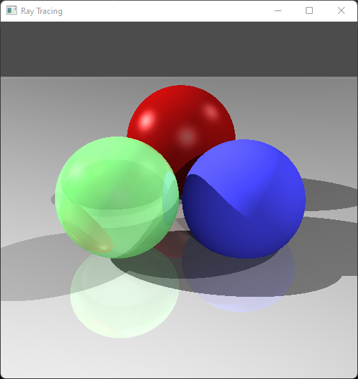
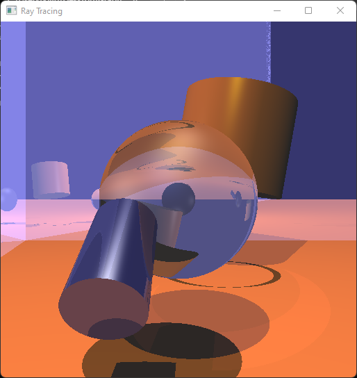

# Comp 4490 Ray Tracer Project Report
###### Student Name: Kushpreet Viria &#x2022; Date: 2023/04/20 &#x2022; Student #: 7859854 &#x2022; Class: Comp 4490 A01
---

## PC specs:
- OS: Windows 11 Home (Version 21H2, build 22000.1817)
- Processor: Intel i7-1165G7 @ 2.80GHz, 2803 Mhz, 4 Core(s), 8 Logical Processor(s)
- GPU: Intel(R) Iris(R) Xe Graphics
- RAM: 16GB
---
## Features implemented:
### <u>Acceleration</u>
- A top down BVH implementation based on what was described in class. Specifically:
    1. The tree starts with the root bounding volume containing all objects. This is the parent volume.
    2. Sort all the objects in the parent volume along an axis, by their centers.
    3. Split this sorted list in half, into 2 lists of objects. Create 2 bounding volumes covering these objects, and insert the left and right child of parent volume in BVH.
    4. Do step ii. for the newly inserted left and right children as parents, but with another sorting axis. Stop if the children only have 1 object.
- Planes were excluded from the BVH. Meshes were split up into each triangle as a seperate object.
- Overall, this BVH implementation's performance improvement is only noticeable when there is a large number of geometry, and the overlap between the initial nodes in the BVH is small. 
    - Take scene `i` for example. Most of the mesh geometry is triangles making up an axis-aligned plane. Thus, the bounding volumes in the BVH for these triangles have very little overlap, making the tree efficient. 
    - This same efficiency isn't found in scenes where the geometry are very close together all over the root bounding volume, resulting in a many overlapping bounding boxes near the root of the tree. An example is the `cornell.json` scene, which I could only render half of over nearly 2.5 hours. The whole tree was very inefficient.
    - The program will tell if the BVH has bad nodes (overlap > 50% between child nodes) in the console when constructing the BVH.
- BVH can be toggled in `raytracer.cpp` and is enabled by default.
- Below is a performance comparison for each scene:

	| Scene |     Normal Time    | BVH Time          |
	|:------|:------------------:|:-----------------:|
	| A     | 31 sec / 0.52 min  | 22 sec / 0.36 min |
	| B     | 61 sec / 1.02 min  | 34 sec / 0.56 min |
	| C     | 101 sec / 1.68 min | 19 sec / 0.32 min |
	| D     | 20 sec / 0.33 min  | 12 sec / 0.20 min |
	| E     | 105 sec / 1.75 min | 55 sec / 0.92 min |
	| F     | 20 sec / 0.33 min  | 12 sec / 0.20 min |
	| G     | 123 sec / 2.05 min | 65 sec / 1.08 min |
	| H     | 45 sec / 0.75 min  | 32 sec / 0.53 min |
	| I     | 404 sec / 6.73 min | 26 sec / 0.43 min |

- Rays are proccessed in multiple CPU threads, up to CPU default.
### <u>Transformation</u>
- All geometry (except infinite planes) can have transformations applied to them in the JSON scene. In JSON, they appear as:
```json
"objects": [
    {
		"type":        "sphere",
		"radius":      2.5,
		"transformations":
		[
			{ "type":"scale", "scale":[1.1,0.9,1] },
			{ "type":"rotation", "axis":[0,0,1], "degrees":90 },
			{ "type":"translate", "translate":[0.1,0,-1.5] }
		]
	}
	] 
```
- Any number of `rotation`,`scale` or `translate` transformations can be supplied, and they are applied from first to last.
- In code, the geometry intersection works by multiplying the incoming ray by the inverse of the transformation matrix before doing any testing. This converts the ray into the object's model space, where we do intersection testing. In model space, `t` is calculated. After obtaining `t`, the intersection vertex and normal in model space are converted to world space by multiplying by the transformation matrix.
- Note, no view matrix exists, but if it did, it would need to be added to the calculations.
- Shown in scenes `c_transformed` and `i_transformed`. Note the transformations vs their regular scenes `c` and `i`.

| Scene C | Transformed C |
|:---------:|:---------------:|
|||

| Scene I | Transformed I |
|:---------:|:---------------:|
|||

### <u>Improved Quality</u>
- Implementation of Schlick's Approximation.
- This causes reflections to be more prominent or less prominent based on the angle of incidence, and the material refraction index.
- When Schlicks approximation is off, all reflections are 100% color intensity. When Schlicks approximation is on, reflections intensity decreases as the angle of incidence decreases, based on material.
- This effect is disabled by default (since not all objects have a refraction index in the JSONs), but can be toggled in `raytracer.cpp` like most other effects. The scenes `h_schlicks_high_angle` and `h_schlicks_low_angle` are ideal for seeing this effect.The effect can also be noticed in `g` vs `g_schlicks` scenes.

| Scene H | Scene H with Schlicks Approximation |
|:---------:|:---------------:|
|||

| Scene G | Scene G with Schlicks Approximation |
|:---------:|:---------------:|
|||

| Scene H Low angle | Scene H High angle |
|:---------:|:---------------:|
|||

### <u>More Geometry</u>
- Additional cylinder geometry was implemented.
- The cylinder is capped at both ends. The cylinder has just a radius and height component in JSON.
- Can be seen in scene `a` and `b`.

| Scene A | Scene B |
|:---------:|:---------------:|
|||

### <u>Techniques</u>
- Antialiasing has been implemented through distribution ray tracing.
- Achieved by sending out 4 additional rays if the first ray intersects an object. The additional 4 rays are offset by a small amount on either top, bottom, left or right of the main ray. The resulting output color is the average of all 5 rays.
- The end results aren't perfect. It looks like rough bluring of the image rather then smoothing out just the edges.
- This effect is enabled by default but is costly. You can toggle this effect, like most other effects, in the `raytracer.cpp` file.
- Scenes `c_AA` and `e_AA` demonstrate antialiasing.

| Scene C | Scene C with Antialiasing |
|:---------:|:---------------:|
|||

| Scene E | Scene E with Antialiasing |
|:---------:|:---------------:|
|||

- Note: Smooth shadows have also been implemented (not shown in any example), which send out many random shadow rays to get a less hard shadow. Very costly and disabled by default, can be toggled in `raytracer.cpp`.

---
## Render times:
- The following are the sorted render times for each scene (BVH is being used in all):

| Scene                 | BVH Time|
|:----------------------|:-------:|
| d                     | 12 sec  |
| f                     | 12 sec  |
| c                     | 19 sec  |
| a                     | 22 sec  |
| h_schlicks_high_angle | 24sec   |
| i                     | 25 sec  |
| i_transformed         | 26 sec  |
| h                     | 32 sec  |
| h_schlicks_low_angle  | 33sec   |
| b                     | 34 sec  |
| c_transformed         | 45 sec  |
| e                     | 55 sec  |
| g_shlicks             | 64 sec  |
| g                     | 65 sec  |
| c_AA                  | 144 sec |
| e_AA                  | 256 sec |

---
## Toggle Effects
- Disable or enable certain effects in `raytracer.cpp`:
```cpp
34 namespace Globals {
35    bool AMBIENT = true;
36    bool DIFFUSE = true;
37    bool SPECULAR = true;
38    bool SHADOWS = true;
39    bool REFLECTIONS = true;
40    bool REFRACTION = true;
41    bool TRANSMISSIVE = true;
42    bool SCHLICKS_APPROXIMATION = true;
43    bool ANTI_ALIASING = true;
44    bool ANTI_ALIAS_INFINITE_PLANES = true;
45    bool BVH = true;
46    bool BVH_INCLUDE_PLANES = true;
47    bool APPROXIMATE_SHADOWS = false;
48    int APPROXIMATE_SHADOWS_RAY_COUNT = 10;
49    int RAYTRACER_DEPTH = 8;
50 }
```
---

## External resources:
- **Threadpool External Libary** (https://github.com/bshoshany/thread-pool):
	- Used to parralelize the trace function call. Uses maximum number of CPU threads available by default, which is based on number of cores (physical or virtual).
- **Tight Bounding volume for a transformed cylinder** (https://www.iquilezles.org/articles/diskbbox):
	- To obtain the bounding box of a cylinder that has been scaled and rotated non-uniformaly.
- **Infinite Cylinder intersection** (https://www.cl.cam.ac.uk/teaching/1999/AGraphHCI/SMAG/node2.html#eqn:rectray):
	- To intersect with the an infinite cylinder aligned on an axis. 
	- The finite cylinder was then obtained by checking if the infinite cylinder point lied between the height bounds of the finite cylinder. 
	- Afterwards the actual intersection with the cylinder caps is done using infinite planes intersections.
- **AA Box intersection** (https://www.scratchapixel.com/lessons/3d-basic-rendering/minimal-ray-tracer-rendering-simple-shapes/ray-box-intersection.html):
	- For BVH to work, ray needs to intersect test with the AABBs.
- **Bounding box overlapped area** (https://stackoverflow.com/questions/25349178/calculating-percentage-of-bounding-box-overlap-for-image-detector-evaluation):
	- Not used much except for debugging. 
	- I was thinking of using this calculation to optimize the BVH somehow when bad nodes were detected, but never got about to doing so.
---
