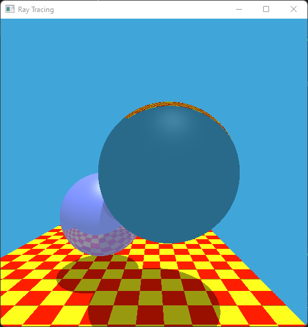
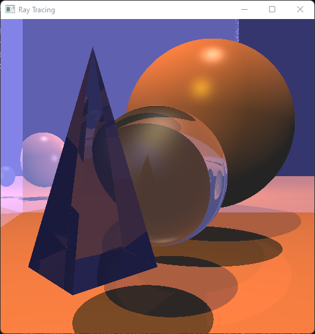

# Comp 4490 Ray Tracer Project Report
---
## PC specs:
- OS: Windows 11 Home (Version 21H2, build 22000.1817)
- Processor: Intel i7-1165G7 @ 2.80GHz, 2803 Mhz, 4 Core(s), 8 Logical Processor(s)
- GPU: Intel(R) Iris(R) Xe Graphics
- RAM: 16GB
---
## Features implemented:
#### <u>Acceleration</u>
- A top down BVH implementation based on what was described in class. Specifically:
    1. The tree starts with the root bounding volume containing all objects. This is the parent volume.
    2. Sort all the objects in the parent volume along an axis, by their centers.
    3. Split this sorted list in half, into 2 lists of objects. Create 2 bounding volumes covering these objects, and insert the left and right child of parent volume in BVH.
    4. Do step 2 for the newly inserted left and right children as parents, but with another sorting axis. Stop if the children only have 1 object.
- Planes were excluded from the BVH.
- Overall, this BVH implementation's performance improvement is only noticeable when there is a large number of geometry, and the overlap between the initial nodes in the BVH is small. 
    - Take scene `i` for example. Most of the mesh geometry is triangles making up an axis-aligned plane. Thus, the bounding volumes in the BVH for these triangles have very little overlap, making the tree efficient. 
    - This same efficiency isn't found in scene `d`, where the spheres are very close together, resulting in a many overlapping bounding boxes near the root of the tree. The whole tree is now much less efficient.
    - The program will tell if the BVH has bad nodes (overlap > 50% between child nodes) in the console when constructing the BVH.
- Below is a performance comparison for each scene:

	| Scene |     Normal Time    | BVH Time          |
	|:------|:------------------:|:-----------------:|
	| A     | 31 sec / 0.52 min  | 22 sec / 0.36 min |
	| B     | 61 sec / 1.02 min  | 34 sec / 0.56 min |
	| C     | 101 sec / 1.68 min | 19 sec / 0.32 min |
	| D     | 20 sec / 0.33 min  | 12 sec / 0.20 min |
	| E     | 105 sec / 1.75 min | 55 sec / 0.92 min |
	| F     | 20 sec / 0.33 min  | 12 sec / 0.20 min |
	| G     | 123 sec / 2.05 min | 65 sec / 1.08 min |
	| H     | 45 sec / 0.75 min  | 32 sec / 0.53 min |
	| I     | 404 sec / 6.73 min | 26 sec / 0.43 min |

- Rays are proccessed in multiple CPU threads, up to CPU default.
#### <u>Transformation</u>
- All geometry (except infinite planes) can have transformations applied to them in the JSON scene. In JSON, they appear as:
```json
"objects": [
    {
		"type":        "sphere",
		"radius":      2.5,
		"transformations":
		[
			{ "type":"scale", "scale":[1.1,0.9,1] },
			{ "type":"rotation", "axis":[0,0,1], "degrees":90 },
			{ "type":"translate", "translate":[0.1,0,-1.5] }
		]
	}
	] 
```
- Any number of `rotation`,`scale` or `translate` transformations can be supplied, and they are applied from first to last.
- In code, the geometry intersection works by multiplying the incoming ray by the inverse of the transformation matrix before doing any testing. This converts the ray to the object's model space, where we do intersection testing. In model space, `t` is calculated. After obtaining `t`, the intersection vertex and normal in model space are converted to world space by multiplying by the transformation matrix.
- Note, no view matrix exists, but if it did, it would need to be added into the calculations.
- Shown in scenes `c_transformed` and `i_transformed`. Note the transformations vs their regular scenes `c` and `i`.

| Scene C | Transformed C |
|:---------:|:---------------:|
|||

| Scene I | Transformed I |
|:---------:|:---------------:|
|||

#### <u>Improved Quality</u>
- Implementation of Schlick's Approximation.
- This causes reflections to be more prominant or less prominant based on the angle of incidence, and the material refraction index.
- When schlicks approximation is off, all reflections are 100% color intensity. When schlicks approximation is on, reflections intensity decreases as the angle of incidence decreases, based on material.
- This effect is enabled by default, but can be toggled in `raytracer.cpp` like most other effects. The scenes `h_schlicks_high_angle` and `h_schlicks_low_angle` are ideal for seeing this effect.The effect can also be noticed in `g` vs `g_schlicks` scenes.

| Scene H | Scene H with Schlicks |
|:---------:|:---------------:|
|||

| Scene G | Scene G with Schlicks |
|:---------:|:---------------:|
|||

| Low angle | High angle |
|:---------:|:---------------:|
|||

#### <u>More Geometry</u>
#### <u>Techniques</u>
---
## External resources:
- Tight Bounding volume for a transformed cylinder
- Cylinder intersection
- Box intersection
---
## Render times:
c_transformed: 52 sec
c_AA: 144 sec
e_AA: 256 sec
g_shlicks: 64
h_schlicks_high_angle: 24sec
h_schlicks_low_angle: 33sec
i_transformed: 25 sec